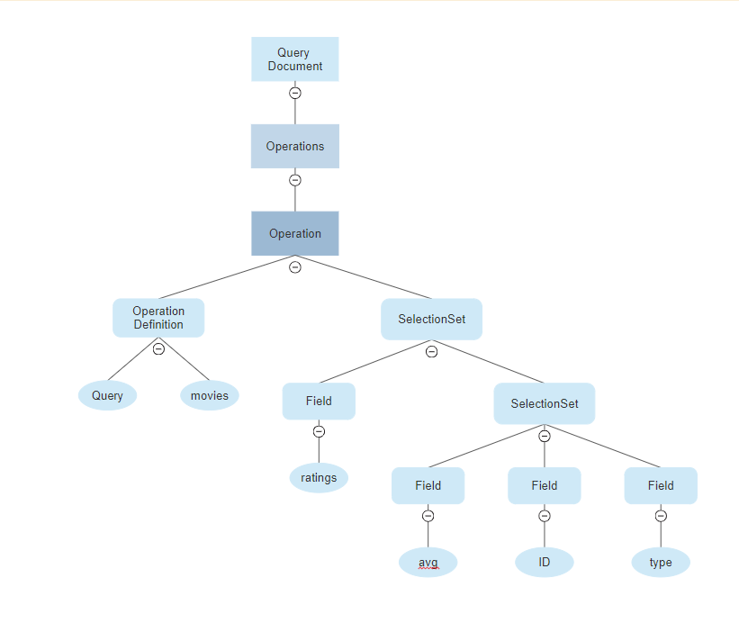
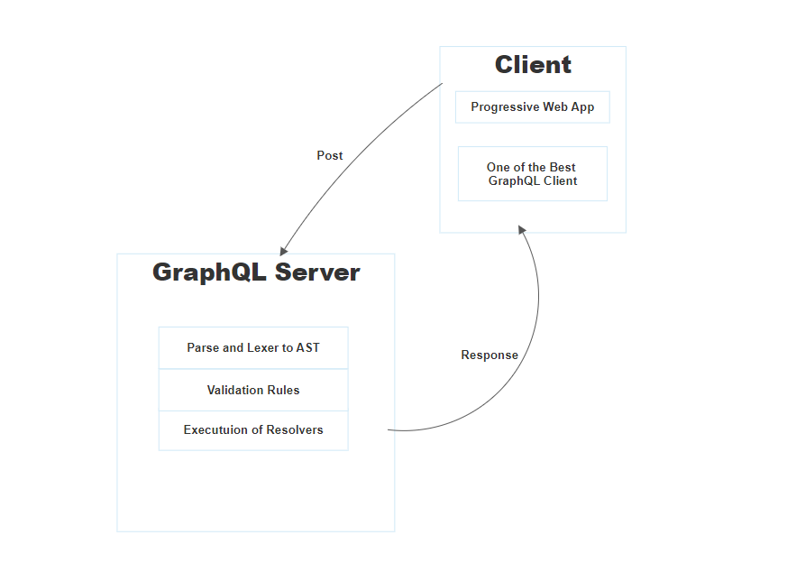

---

>“GraphQL is a query language for your API that shifts the contract between clients and servers that allows the server to say ‘these are the capabilities that I exposed’ and allows the clients to describe their requirements in a way that ultimately empowers product developers to build the products they want to create.” — Dan Schafer, GraphQL Co-Creator

## Why GraphQL

- GraphQL is really simplest form of exchanging data between your clients and  server

- The languages like javascript dynamically typed(weakly typed) makes developing process error prone, GraphQL makes you able to works as safe as possible in terms of Type-Safe and makes your developing experience as perfect as possible.

- You can declare exactly what you need from server and receive the requested data in a predictable way, GraphQl makes you retrieve many resources from the server in a single request  and writing GraphQL queries is really easy.

- There are several implementations of GraphQL and the project like **[Apollo](https://www.apollographql.com/docs/react/)** makes you able to retrieve data as easy as possible to your client, believe me very strong and great community support, there are several post about problems on current APIs and comparison between RESTful APIs but today we are going to talk about hidden and production ready parts of GraphQL.

## Network Layer

- Actually GraphQL spec doesn't define anything related to networking and actually what GraphQL is more about Parsing, Validating and Executing query so I want to give you a brief introduction of networking part of GraphQL because i believe there are some misunderstanding about it.

- So before a query get executed your server should receive a request and there is no new protocol or something, GraphQL is typically can be **[served over HTTP](https://graphql.org/learn/serving-over-http/)** via a single endpoint which expresses the full set of capabilities of the service or you can even use **[MQTT](https://www.npmjs.com/package/graphql-mqtt-subscriptions)**.

- So GraphQL is actually transport layer agnostic, so you could choose protocols other than HTTP to implement your server and the community has largely standardized on HTTP POST requests, but it's more likely up to you how to send GraphQL requests, you cloud even send your request with  custom header, protoBuf or even as a cookie.

- And it is good to mention you can clearly see that we mention single endpoint so not like Rest APIs which expose a suite of URLs, that is also available on GraphQL but not recommended because of tools like **[GraphiQL](https://github.com/graphql/graphiql)**.

- GraphQL services usually respond using JSON, but again this isn't required. Maybe JSON may seem a bad choice for you and you may want use GZIP.
>Accept-Encoding: gzip

- So being protocol agnostic makes able community to create a really cool projects like **[Neo4j and GraphQL integration](https://neo4j.com/developer/graphql/)**, so there are various implementations of GraphQL servers, all of them have different approaches there is no good or bad.

## GraphQL Documents
  >A GraphQL Document describes a complete file or request string operated on by a GraphQL service or client. A document contains multiple definitions, either executable or representative of a GraphQL type system.

  - In GraphQL when a client makes a request to GraphQL server with GraphQL query language, we refer to these request as documents and a document may contain operations (queries, mutations, and subscriptions) as well as fragments(A GraphQL fragment is a shared piece of query logic, basically you able to reuse logic), a common unit of composition allowing for query reuse.

## Parsing queries

- We handled the networking, we are able to pass these queries in our system via network calls, great!

- Clients use the GraphQL query language to make requests to a GraphQL service and GraphQL's Query Language is made of there main thing;
  - An alphabet, set of char to make a language. GraphQL documents are expressed as a sequence of Unicode characters
  - Tokens, The things carry special meaning like Query, Mutation, !	$	(	)	...	:	=	@	[	]	{	|	}
  - Formal grammar, Basically rules of syntax.

 ##### An example of query

- GraphQL has an parser to parse incoming strings, and does Lexical Analysis and Syntactic Analysis to create an **Abstract Syntax Tree**

- GraphQL spec defines query language perfectly but various implementation has their own lexer, parser or the data structure. This is very important thing because every language has their own data structure and language specific features and also this makes GraphQL can be used in widely different ways.

- If you want to be evolve in GraphQL community and get to know more about project you should read **[GraphQL Spec](https://spec.graphql.org/)**

## Production Ready Queries

- Last section we talked about parsing queries, but what happens if queries become too long and taking too much time to parse?

- Maybe your GraphQL implementation doesn't makes you happy about parsing your long queries so there is a solution for that **Static Queries**.
  - Static queries makes you able to avoid generating queries dynamically at runtime unless you have an public api and facing tons of different queries like github.
  - You can persist your queries to database on production and that makes your server only accept the specific queries and your system become more secure and reliable.
  - It is easy to keep track of your queries and Analysis of queries.
  - There are also good practices around static queries one is you can name your queries and your client only send IDs, your server keep track of these ID to identify queries that     means you don't event need to send queries.
  - After GraphQL query parsed, there is a validation phase which makes sure your query is valid that is make sure you are requesting fields that exist, arguments populating etc.
    and also GraphQL spec says that is still possible to an invalid request may pass all the validation rules so that makes persisted queries must.
  - In simple terms you don't need to lexer, parser or validator for your queries in production.

## Execution of queries

  

  - After being validated, a GraphQL query is executed by a GraphQL server and GraphQL generates a response from a request via execution.
  - Every request consists of a few pieces of information.
    - The schema to use, a GraphQL schema.
    - A Document with GraphQL OperationDefinition and may contain FragmentDefinition.
    - A document may have more than one Operation.
    -Optionally: The name of the Operation in the Document to execute.
    -Optionally: Values for any Variables defined by the Operation.
    -An initial value corresponding to the root type being executed. Conceptually, an initial value represents the “universe” of data available via a GraphQL Service. It is common for a GraphQL Service to always use the same initial value for every request.
  - Given this information, the result of ExecuteRequest() produces our response.
    - ExecuteRequest calls GetOperation() function.
    - GraphQL parses and invalidates the variables passed in to operation using method called CoerceVariableValues
       - GraphQL has Scalar Coercion, as we mentioned before GraphQL doesn't use particular way to receive requests but GraphQL takes care common formats like HTTP/JSON and there are some differences with JSON and GraphQL type System so to create solution for this problems GraphQL has some rules coercing coming input types and output coercions allow mapping GraphQL type system.
    - Every operation has OperationDefinition(query, mutation, subscriptions) and ExecuteSelectionSet() method.
    - SelectionSet has Fields like (movies, stars, title, year, oscars etc.)
    - GraphQL calls SelectionsSet until hitting the response and calls ResolveFieldValue() and CompleteValue() and checks the output type.

## Caching graphql

>In an endpoint-based API, clients can use HTTP caching to easily avoid refetching resources, and for identifying when two resources are the same. The URL in these APIs is a globally unique identifier that the client can leverage to build a cache. In GraphQL, though, there's no URL-like primitive that provides this globally unique identifier for a given object. It's hence a best practice for the API to expose such an identifier for clients to use.

- Globally Unique IDs
  - One possible unique identifier is fields like ID, and also be careful about these IDs for example apollo-client uses IDs and __typename to cache incoming request, you may end up getting same result twice. Make sure your IDs unique.
  - If the backend uses something like UUIDs for identifiers, then exposing this globally unique ID may be very straightforward!
  - Oftentimes, that's as simple as appending the name of the type to the ID and using that as the identifier; the server might then make that ID opaque by base64-encoding it.
  - While having the server derive that ID simplifies the client, the client can also derive the identifier. Oftentimes, this would be as simple as combining the type of the object (queried with __typename) with some type-unique identifier.
  - DataLoader project is great solution for caching and batching take a look at **[DataLoader](https://github.com/graphql/dataloader)**.

## GraphQL implementations && Best Practices
  - After all we talked, we can clearly see that GraphQL is not equal to its implementations but GraphQL is really flexible and widely used by various different technologies.
  - GraphQL has only been a publicly-available technology for a little over a year, so there aren’t yet clear best practices but there are really good implementations out there, go check them out.
  - Some of GraphQL implementations really cool features, for example Relay or Apollo Client has support for GraphQL "Connections" that ease your job on pagination.
  - Schema stitching
    - One of the main benefits of GraphQL is that we can query all of our data as part of one schema, and get everything we need in one request. But as the schema grows, it might become hard to manage it all as one codebase, and it starts to make sense to split it into different modules. We may also want to decompose your schema into separate microservices, which can be developed and deployed independently. We may also want to integrate our own schema with remote schemas.
  - If you are doing server-side rendering be careful about your queries because not every query takes same fetch time. At some places you may need to avoid using ssr and also be careful about small queries, if you end up like too many small queries with ssr, you may run into some performance issues.

### Oguz
---
## Useful links

**[GraphQL Spec](https://spec.graphql.org/)**

**[GraphQL Implementations](https://github.com/chentsulin/awesome-graphql)**

**[Official GraphQL Website](https://graphql.org/)**

**[How to GraphQL](https://www.howtographql.com/)**

---

